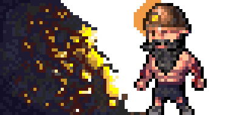
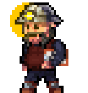
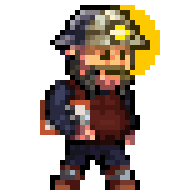
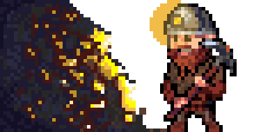
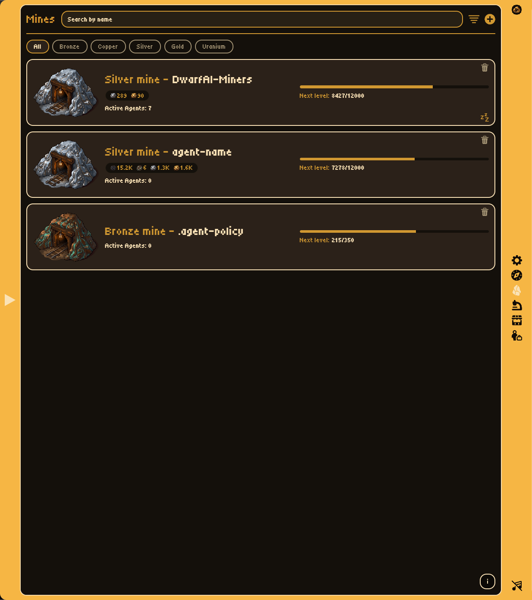
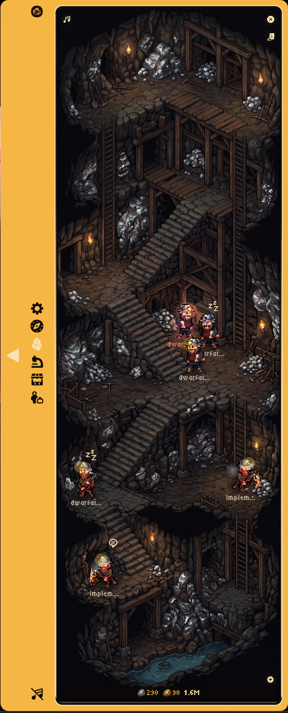
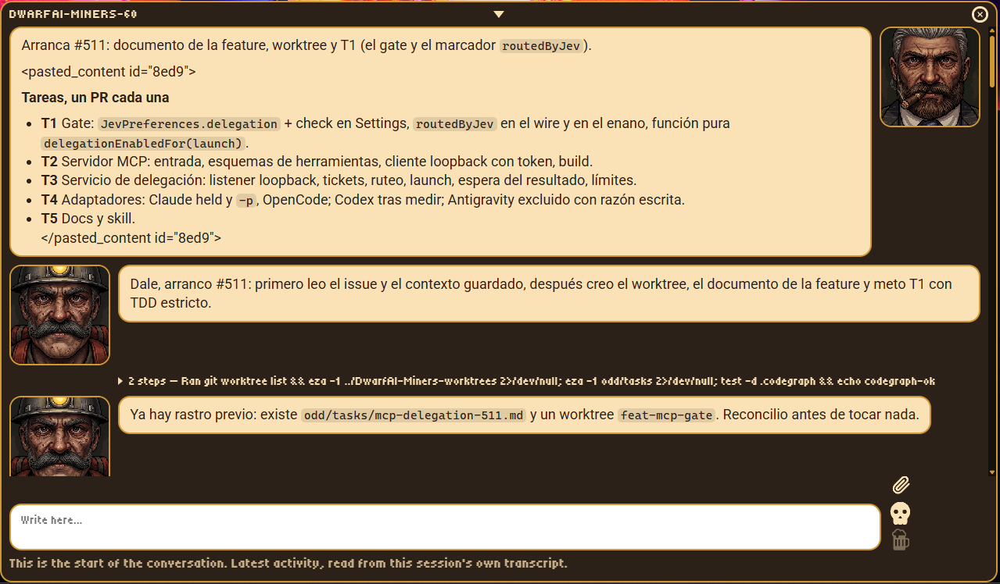
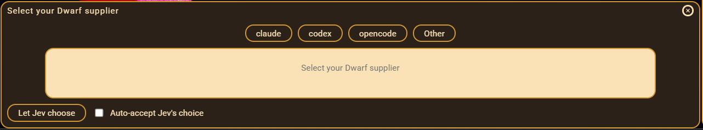
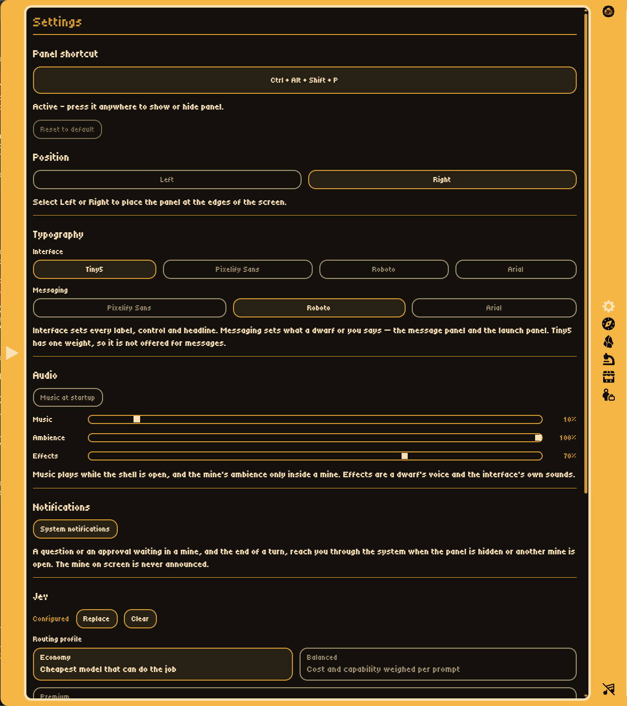

<p align="center">
  
</p>

<h1 align="center">DwarfAI-Miners</h1>

<p align="center">
  Your AI coding sessions as a tiny isometric mining colony, floating on your desktop.
</p>

<p align="center">
  
  &nbsp;&nbsp;&nbsp;&nbsp;
  
   &nbsp;&nbsp;
  
  &nbsp;&nbsp;&nbsp;&nbsp;
  
</p>

<div align="center">

[](https://github.com/JeronimoRepetto/DwarfAI-Miners/actions/workflows/ci.yml)
[](https://github.com/JeronimoRepetto/DwarfAI-Miners/releases/latest)
[](https://github.com/JeronimoRepetto/DwarfAI-Miners/releases)

[](LICENSE)
[](https://ko-fi.com/jeronimorepetto)


</div>

DwarfAI-Miners is a floating desktop panel that turns active AI coding sessions into mines and
dwarfs. A mine represents one project; workers and foremen represent the agents currently
operating in that project.

**Status:** functional MVP. Claude Code and Codex session detection, live IPC updates, mine
tiers, animated dwarfs, terminal focus with transcript fallback, autostart, and packaging are
implemented. Windows is the verified platform; macOS and Linux build and are unit-tested but
have not been run end to end yet — see the support matrix below.

## The bigger picture

DwarfAI-Miners is growing toward an **idle game for AI agents**: your agents work in the mines,
you watch the colony develop, and you step in when a session needs direction. The project is
intended to make working with agents feel both useful and alive — part control room, part
observer, and eventually part game.

### What it is today

- **Observer:** reads local Claude Code and Codex session data and turns projects, agents, status,
  messages, and mined materials into a living colony.
- **Control surface:** lets you launch supported sessions, focus their external terminal, open a
  live transcript viewer, send messages, kick work, and answer agent questions.
- **Terminal companion:** it works alongside the provider's terminal rather than replacing it with
  a terminal emulator. The panel is already the interactive surface for the actions it supports;
  the underlying provider still owns the actual process and terminal.

Claude Code and Codex are the two currently supported providers. More providers can be added once
their session artifacts and interaction paths meet the project's verification bar.

### Where it is going

Once the provider integrations and core interaction model are complete, the **Laboratory** and
**Market** will turn the colony's mined materials into game systems. The planned direction is to
use the Lab to change dwarf skins and other cosmetic loadouts, and the Market to spend the raw
materials the agents mine. Those systems are intentionally not shipped yet: both screens currently
show an unavailable state, while the material ledger provides the foundation for the future
economy.

The goal is not to make agent work less trustworthy by hiding it behind game mechanics. The game
layer should make real agent activity easier and more enjoyable to understand — an idle game built
around work that is actually happening.

## What it looks like

The panel is designed to be understood at a glance: the map answers **where work is happening**,
and the mine answers **what each agent is doing**. The hero animation uses privacy-safe generic
content; it contains no real project names, paths, or session data.

## Feature tour

<table>
  <tr>
    <td align="center"></td>
    <td align="center"></td>
    <td align="center"></td>
  </tr>
  <tr>
    <td align="center"><strong>Map</strong><br>See every active project at once.</td>
    <td align="center"><strong>Mines</strong><br>Search and open a project directly.</td>
    <td align="center"><strong>Mine interior</strong><br>Watch the crew and their status.</td>
  </tr>
  <tr>
    <td align="center"></td>
    <td align="center"></td>
    <td align="center"></td>
  </tr>
  <tr>
    <td align="center"><strong>Messages</strong><br>Read history, send, kick, and answer questions.</td>
    <td align="center"><strong>Launch</strong><br>Start Claude Code or Codex in a project mine.</td>
    <td align="center"><strong>Settings</strong><br>Configure the shortcut and panel behavior.</td>
  </tr>
</table>

The screenshots in this tour are interface references with generic, privacy-safe content. The
pixel-art assets and interface design are by Jeronimo Repetto; the [art pipeline](CONTRIBUTING.md#artwork)
explains how the shipped assets are processed.

## Highlights

- **Live session detection** — Claude Code and Codex sessions become dwarfs the moment they
  appear, no configuration required.
- **Two illustrated views** — a world map that follows the time of day, with one tier-coloured
  marker per project, and a mine interior where the crew swings pickaxes, naps, or walks out.
- **Send and kick** — deliver a message to a session or kick an agent straight from the panel.
- **Instant updates** — an opt-in Claude-hooks push channel turns the 2-second poll into tens of
  milliseconds.
- **Terminal focus** — clicking a dwarf focuses its terminal window, with a live transcript
  viewer as the fallback.
- **Autostart and tray** — starts at login, lives in the tray, and hides instead of closing.

Platform caveats apply — the [support matrix](#platform-support) below is honest about what is
verified versus built and unit-tested only.

## Install

Download the installer for your OS from the
[latest release](https://github.com/JeronimoRepetto/DwarfAI-Miners/releases/latest):

| Platform | File                                                          |
| -------- | ------------------------------------------------------------- |
| Windows  | `DwarfAI-Miners-Setup-*.exe` (installer) or `-Portable-*.exe` |
| macOS    | `DwarfAI-Miners-*.dmg` (arm64 or x64, matching your Mac)      |
| Linux    | `DwarfAI-Miners-*.AppImage` or the `.deb` package             |

Nothing is code-signed or notarized (see [`docs/signing.md`](docs/signing.md)), so:

- **macOS**: Gatekeeper blocks the unsigned app on a normal double-click. Right-click (or
  Control-click) the app and choose **Open**, then confirm in the dialog — only needed once.
- **Linux**: make the AppImage executable before running it: `chmod +x DwarfAI-Miners-*.AppImage`.

Every release is built and packaged on the target OS, but Windows is the only platform that has
been run end to end — see the support matrix below for exactly what is verified versus built and
unit-tested only.

### First run

Launch DwarfAI-Miners and it will start minimized to the tray. Use **Ctrl+Alt+Shift+P** (or the
tray menu) to open the panel. Once packaged, the app enables start-at-login by default; you can
change that choice from the tray menu. The first run never sends session data anywhere — see
[Privacy](docs/privacy.md).

## Quick start

```bash
pnpm install
pnpm dev
```

The panel starts hidden. Press **Ctrl+Alt+Shift+P** or click the tray icon to show it. The
combination is configurable: open the gear in the panel titlebar and record a new one. If
another application already owns a combination, registration fails, the previous shortcut is
re-claimed, and the settings panel says so rather than showing a shortcut that does nothing.

> pnpm 11 build scripts are allowed through `allowBuilds` in `pnpm-workspace.yaml`. If the
> Electron binary is missing after an interrupted install, run `pnpm rebuild electron`.

CI (`.github/workflows/ci.yml`) runs seven checks on every push to `main` and on every pull
request: privacy guard, typecheck, lint, format check, skills-sync check, tests, and build.

## Platform support

Every operating-system-specific behavior sits behind a port selected in one place
(`src/main/platform/platformAdapters.ts`), and each adapter's commands and file contents are
unit-tested as pure builders. What has _not_ happened is running those commands on a real Mac
or Linux desktop, so the table is honest about the difference.

<details>
<summary><strong>Full support matrix</strong> (Windows verified; macOS/Linux built, integration-pending)</summary>

| Capability                              | Windows                       | macOS                                  | Linux                                  |
| --------------------------------------- | ----------------------------- | -------------------------------------- | -------------------------------------- |
| Overall                                 | **Verified**                  | Built, integration-pending             | Built, integration-pending             |
| Session detection (Claude Code / Codex) | Verified                      | Expected to work (home-relative paths) | Expected to work                       |
| Codex liveness probe                    | PowerShell `Win32_Process`    | `pgrep -f codex`                       | `pgrep -f codex`                       |
| Click-to-focus a terminal               | user32 via PowerShell         | `ps` + System Events (`osascript`)     | **Unsupported** — falls back to viewer |
| Live transcript viewer                  | Windows Terminal / PowerShell | Terminal.app via `osascript`           | `x-terminal-emulator` → … → `xterm`    |
| Type a message into a terminal session  | SendKeys                      | **Disabled** (built, gated)            | **Unsupported**                        |
| Relay a message to a named session      | Supported                     | Supported                              | Supported                              |
| Queue a message to a Codex CLI session  | **Verified**                  | Expected to work (spawns `codex`)      | Expected to work (spawns `codex`)      |
| Start at login                          | HKCU Run key                  | `~/Library/LaunchAgents` plist         | `~/.config/autostart` desktop entry    |
| Packaging                               | NSIS + portable               | dmg + zip (arm64 & x64)                | AppImage + deb                         |

Notes on the three honest gaps:

- **Linux window focus** is unsupported on purpose. `wmctrl`/`xdotool` are X11-only, absent by
  default, and blocked outright under Wayland; guessing would mean hanging on a tool that is not
  there. Clicking a dwarf goes straight to the transcript viewer instead.
- **macOS keystroke injection** is implemented (`osascript` + System Events) and unit-tested,
  but it is gated off behind `DARWIN_CONSOLE_INPUT_ENABLED` until it has been run on a real Mac —
  it also needs the user to grant Accessibility permission, which the app cannot detect. While it
  is off, Send and Kick render disabled with their reason rather than silently typing nowhere.
- **Session-data layouts** (`~/.claude`, `~/.codex`) are assumed to be identical on all three
  platforms. They are home-relative already and nothing in the formats is Windows-specific, but
  this has not been confirmed against real macOS/Linux fixtures.

</details>

## What the panel shows

The panel is an isometric idle-game with two views:

**Map view (default).** An illustrated world seen from orbit, in one of four paintings chosen by
your own clock — morning, day, sunset, night. Every project with an observed AI CLI session
appears on one of the map's 74 spawn locations as a pulsing hexagon coloured by tier: Bronze
(cyan), Copper (orange-brown), Silver (grey), Gold (yellow), Uranium (green). A project is
assigned a free location at random the first time the app sees it and that location is remembered,
so a mine never moves — not between refreshes and not across restarts. Resting the pointer on a
marker for a moment shows its tier, the project name and how many agents are working in it;
clicking enters the mine.

**Mine interior.** The cave art for that tier, with the crew standing on the walkable
floor along the bottom. Each agent is a dwarf animated by swapping poses:

- **working** alternates two pickaxe swings,
- **waiting** sits still on one resting pose beneath a drifting "z z z",
- **leaving** alternates two walking poses, mirrored toward the exit, fading during the
  runtime grace window,
- the **foreman** stands apart and looks up from his log book now and then.

The provider is shown by a small badge on the sprite rather than by tinting the art.
Hovering a dwarf shows name, provider, model, effort, and status. When an agent's last
message changes, a comic speech bubble appears above it for a few seconds.

### Focusing a session's terminal

Clicking a dwarf first tries to focus its terminal window. Claude sessions provide a PID, so
this works when their process ancestry reaches a supported terminal host (and on a platform
where focusing is supported at all — see the matrix above). Codex rollouts do not expose a
reliable PID; DwarfAI-Miners then opens a terminal tailing the transcript live, and failing
that shows the recent activity feed on a parchment board inside the panel.

The live viewer ships twice, once per shell: `resources/dwarf-feed-viewer.ps1` for Windows and
`resources/dwarf-feed-viewer.sh` for macOS and Linux. The POSIX one is a plain `sh` script
around `tail -f`, and it parses JSONL with a small JavaScript formatter run on the Node runtime
the app already bundles (`process.execPath`, via `ELECTRON_RUN_AS_NODE`), so no system Node is
required. If that formatter cannot run, the viewer falls back to showing the raw JSONL rather
than nothing.

### Art pipeline

The renderer ships processed art in `src/renderer/src/assets/art/` — committed, so a clone
builds and runs without the source images. `pnpm art:build` regenerates it from the
originals: AI-generated, opaque high-resolution files delivered by the product owner, which
live outside the repository (default `<home>/Downloads/DwarfAI-Miners`, overridable with
`--src <dir>` or `DWARFAI_MINERS_ART_SRC`) and are never modified. The script itself is
platform-neutral: every path goes through `node:path`.

The script chroma-keys the dwarf and mound images off their flat backdrop — sampling the
key color from each image's own four corners, because it differs per image — crops all nine
dwarf poses to one shared canvas so animation frames never jitter, and downscales the opaque
background scenes. Its pure helpers are unit tested in `scripts/art/keying.test.mjs`.

### Application icon

Same idea as the art pipeline: committed, derived output, regenerated by a script rather than
hand-edited. `pnpm icons` (`scripts/build-icons.mjs`) composites `mound-gold.png`
onto a dark circular badge — a strong, high-contrast silhouette is what actually survives being
shrunk to a 16x16 tray icon — and writes every size electron-builder and the app itself need:
`build/icon.ico` (Windows, multi-size), `build/icon.icns` (macOS), `build/icon.png` (Linux, 512),
and `resources/tray-icon.png` / `tray-icon@2x.png` / `app-icon.png` for the tray and window icons
at runtime. The badge math is unit tested in `scripts/art/badge.test.mjs`; running the script
twice in a row reproduces every output file byte-for-byte. The README logo
(`docs/assets/logo.png`) is a committed copy of that same `build/icon.png`.

## Provider support

| Provider    | Support | Liveness and hierarchy                                                                                                                                                                                                                 |
| ----------- | ------- | -------------------------------------------------------------------------------------------------------------------------------------------------------------------------------------------------------------------------------------- |
| Claude Code | Active  | Uses `~/.claude*/sessions/<pid>.json`, verifies a live PID, and reads parent/subagent transcripts. Multiple Claude roots are supported.                                                                                                |
| Codex       | Active  | Uses the `state_5.sqlite` registry, `logs_2.sqlite` heartbeats, rollout growth and open-turn events; mtime is the last resort, never the lead (#1). `thread_spawn.parent_thread_id` is used for verified worker/foreman relationships. |
| Gemini CLI  | Planned | No Gemini CLI session artifacts were available for verification. The local `.gemini` data belongs to Antigravity and is intentionally not parsed.                                                                                      |

Codex liveness is heuristic: a recently modified rollout can remain visible until the
configured liveness window expires after the CLI closes.

For Claude, the main session dwarf is always the foreman — it is the orchestrator whether or
not it currently has subagents out — and subagents are always workers. A subagent leaves the
crew as soon as its `<task-notification>` reports `completed`, `failed` or `killed`, and
DwarfAI-Miners remembers that so an agent whose notification later scrolls out of the transcript
tail can never come back as a ghost. Codex promotion still comes from a verified
`thread_spawn` parent link.

## Startup and tray behavior

- Packaged builds enable autostart on the first successful launch (the tray item reads **Start
  with Windows** on Windows and **Start at login** elsewhere).
- A marker in Electron's user-data directory prevents later launches from overriding a tray
  opt-out.
- Development runs never write an autostart entry or the marker.
- Closing the panel hides it; **Quit** in the tray exits the process.
- On macOS the app hides its Dock tile: it lives in the menu bar, and its only window is the
  floating panel.

<details>
<summary><strong>Where the autostart entry is written</strong>, per platform</summary>

| Platform | Location                                                                                          |
| -------- | ------------------------------------------------------------------------------------------------- |
| Windows  | `HKCU\Software\Microsoft\Windows\CurrentVersion\Run`, value `DwarfAI-Miners`                      |
| macOS    | `~/Library/LaunchAgents/com.jeronimorepetto.dwarfaiminers.plist` (`RunAtLoad`, `KeepAlive=false`) |
| Linux    | `$XDG_CONFIG_HOME/autostart/dwarfai-miners.desktop`, defaulting to `~/.config/autostart/`         |

Only Windows has a migration to run: existing installs move automatically on first launch after
the update — the legacy `AgentName` Run value is removed, and the new value is written only if
autostart was on. No macOS or Linux build shipped before the rename, so there is nothing to
migrate there.

</details>

## Instant updates (Claude hooks)

Off by default, opt-in from the tray: **Instant updates (Claude hooks)**. It adds a push
channel on top of the 2-second poller so a session appearing, a turn ending or a subagent
finishing shows up in tens of milliseconds instead of on the next poll.

Turning it on does three things, and turning it off undoes all three:

1. Binds a loopback HTTP listener on `127.0.0.1:HOOKS_PORT` (47821 by default). Loopback only —
   it is never reachable from the network.
2. Writes one hook entry per event into `settings.json` in every configured Claude root, for
   `SessionStart`, `Notification`, `Stop`, `SubagentStop` and `SessionEnd`. The command is a
   one-line curl invocation — `curl.exe` on Windows to bypass PowerShell's alias, plain `curl`
   elsewhere — that forwards the hook's own JSON to the listener and exits; Windows 10 1803+
   ships `curl.exe`, and enabling refuses with an explanation if it is missing.
3. Records the choice in a marker file under Electron's user-data directory, so the channel
   comes back on the next launch.

Every event triggers the same full rescan the poller already runs, coalesced so a burst inside
one turn costs one extra scan rather than one per event. **The poller stays the ground truth**:
it remains the only startup-reconciliation source, and a missed or malformed hook self-heals on
the next 2-second tick. A user who never opts in sees no behavior change at all.

Safety around `settings.json`, which is the user's own global Claude configuration:

- A pristine copy is taken as `settings.json.dwarfai-backup` before the file is modified for
  the first time, and never overwritten afterwards.
- Install and uninstall only ever touch entries whose command carries the `dwarfai-miners-hook`
  marker. Hooks belonging to any other tool keep their position and content, and unknown keys
  anywhere in the file are preserved.
- Re-enabling replaces our entries instead of duplicating them; disabling removes only ours,
  dropping an event key (and `hooks` itself) once it held nothing else.
- Indentation, line endings and the trailing newline are read back and reproduced, so the diff
  is our addition and nothing more. A file that cannot be parsed is reported and left untouched.
- Requests carry a per-install random token generated on first enable, so another local process
  cannot forge events; a request without it is dropped before its body is read, and bodies are
  capped at 4 KB.

**Turn the toggle off before uninstalling DwarfAI-Miners.** Nothing runs a hook-removal pass at
uninstall time yet, so entries left behind would point at a listener that no longer exists —
harmless (Claude Code treats a failed hook command as a non-blocking error) but untidy.

## Configuration

Everything below is optional — the defaults work out of the box. **Which mechanism you use
depends on how you are running DwarfAI-Miners**, because `dotenv` resolves `.env` relative to the
working directory, and an installed app never runs from this repository.

| How you run it                    | Where settings go                                                     |
| --------------------------------- | --------------------------------------------------------------------- |
| Development checkout (`pnpm dev`) | Copy `.env.example` to `.env` in the repo root.                       |
| Installed app                     | A `config-v1.json` file in the app's user-data directory (see below). |

Settings are resolved most specific first: **real environment variables → the user-data config
file → built-in defaults.** A real environment variable therefore always wins, on either setup,
and a development checkout with a `.env` behaves exactly as it always has.

### Configuring an installed app

Create `config-v1.json` next to the app's other preference files, in the user-data directory:

| Platform | Path                                                          |
| -------- | ------------------------------------------------------------- |
| Windows  | `%APPDATA%\DwarfAI-Miners\config-v1.json`                     |
| macOS    | `~/Library/Application Support/DwarfAI-Miners/config-v1.json` |
| Linux    | `~/.config/DwarfAI-Miners/config-v1.json`                     |

It is a flat JSON object whose keys are the variable names from the table below. Values may be
strings or numbers, so both spellings below work:

```json
{
  "CLAUDE_CONFIG_DIRS": "~/.claude;~/.claude-work",
  "TIER_COPPER_KB": 200
}
```

Restart the app to pick up changes. A missing or corrupt file is ignored and the app starts on
defaults, so it is safe to delete if you want to start over. An invalid _value_ — a port of
`70000`, tier thresholds out of order — fails fast at startup with the same message it would
produce as an environment variable, rather than being silently ignored; setting the same key as a
real environment variable overrides the file if you ever need to start the app without editing it
first.

<details>
<summary><strong>All settings</strong> (defaults work out of the box)</summary>

Use these names as `.env` keys in a development checkout, and as JSON keys in the config file
above for an installed app.

| Variable                   | Default                   | Meaning                                                                                               |
| -------------------------- | ------------------------- | ----------------------------------------------------------------------------------------------------- |
| `POLL_INTERVAL_MS`         | `2000`                    | Provider scan interval in milliseconds.                                                               |
| `LIVENESS_WINDOW_S`        | `90`                      | Reserved general activity window.                                                                     |
| `CODEX_LIVENESS_WINDOW_S`  | `300`                     | Maximum rollout mtime age considered live.                                                            |
| `CODEX_HEARTBEAT_WINDOW_S` | `300`                     | How recent a `logs_2.sqlite` row must be to count as a liveness heartbeat.                            |
| `CODEX_SCAN_DAYS`          | `7`                       | How many day-directories (today back N-1 days) to scan for rollouts.                                  |
| `CODEX_IDLE_RETENTION_S`   | `3600`                    | Extra time a quiet-but-open rollout stays visible while a codex process is running.                   |
| `CODEX_SESSIONS_ROOT`      | `~/.codex/sessions`       | The Codex rollout directory to scan. A leading `~` is expanded.                                       |
| `CODEX_STATE_DB`           | `~/.codex/state_5.sqlite` | Codex's thread registry, opened read-only. Missing file: rollout-only detection.                      |
| `CODEX_LOGS_DB`            | `~/.codex/logs_2.sqlite`  | Codex's structured log stream, used read-only as a liveness heartbeat.                                |
| `DWARF_LEAVE_GRACE_S`      | `20`                      | How long a dwarf whose agent finished/disappeared stays visible as "leaving".                         |
| `TIER_CACHE_TTL_S`         | `600`                     | Mine-tier cache lifetime.                                                                             |
| `TIER_COPPER_KB`           | `100`                     | Source-code byte-weight threshold for copper, in KB.                                                  |
| `TIER_SILVER_KB`           | `500`                     | Source-code byte-weight threshold for silver, in KB.                                                  |
| `TIER_GOLD_KB`             | `2048`                    | Source-code byte-weight threshold for gold, in KB.                                                    |
| `TIER_URANIUM_KB`          | `8192`                    | Source-code byte-weight threshold for uranium, in KB.                                                 |
| `CLAUDE_CONFIG_DIRS`       | `~/.claude`               | Semicolon-separated Claude roots. Add more to scan several accounts, e.g. `~/.claude;~/.claude-work`. |
| `SENDTEXT_RELAY_MODEL`     | `haiku`                   | Model the one-shot `claude -p` relay runs when delivering a message to a session.                     |
| `SENDTEXT_TIMEOUT_S`       | `60`                      | How long a message delivery may take before it is reported as timed out.                              |
| `HOOKS_PORT`               | `47821`                   | Loopback port for instant updates (see above). Nothing binds it until you opt in.                     |
| `CLAUDE_CLI_PATH`          | _(detect)_                | Explicit path to the `claude` binary. Blank detects it in the known install locations, then PATH.     |
| `CODEX_CLI_PATH`           | _(detect)_                | Explicit path to the `codex` binary. Blank detects it in the known install locations, then PATH.      |

Tier thresholds must be strictly increasing.

`CODEX_CLI_PATH` is also what the Codex message queue addresses. If detection lands on an
npm-global `codex.cmd`/`.bat` shim, sending is refused with that reason rather than run: a shim
cannot be spawned without a shell, and a shell would re-parse the message — expanding `%VAR%`
into it, or letting a quote end the argument. Point this at the real executable to fix it.
Launching a new Codex session from the Add panel has no such limit: the panel reads the shim and
starts the `node` entry it names directly, so an npm or pnpm install launches without an override.

</details>

## Verification and packaging

```bash
pnpm typecheck
pnpm lint
pnpm format:check
pnpm test
pnpm build
```

The whole test suite is platform-independent: every per-OS builder is tested by passing the
platform explicitly, so the same assertions run and pass on any host. CI currently runs the
Windows leg only; a macOS/Linux matrix is a follow-up (see `.github/workflows/ci.yml`).

Packaging is per-platform and must run on that platform (electron-builder cannot cross-build a
dmg or a deb):

| Command              | Runs on | Output in `release/`                        |
| -------------------- | ------- | ------------------------------------------- |
| `pnpm package`       | Windows | unsigned NSIS installer + portable exe, x64 |
| `pnpm package:mac`   | macOS   | dmg + zip, arm64 and x64                    |
| `pnpm package:linux` | Linux   | AppImage + deb, x64                         |

`package:mac` names no targets on the command line, and that is deliberate. Naming any target
there replaces the configured list _including its architectures_, after which electron-builder
falls back to the build host's own architecture — which is how two releases shipped arm64 only
from an arm64 runner. Leaving the list off keeps `build.mac.target` in `package.json` the single
place that decides which architectures ship.

Nothing is code-signed or notarized, so Windows SmartScreen and macOS Gatekeeper will both warn —
see [`docs/signing.md`](docs/signing.md) for exactly what that means and what it takes to fix.
The application icon (installer, exe, tray, and window) is generated from the mound art
by `pnpm icons` (`scripts/build-icons.mjs`); see `build/icon.*` and `resources/*-icon*.png`.

## Architecture

```text
ClaudeProvider / CodexProvider
            |
          Poller -> aggregateMines + TierService
            |
        AgentRuntime  <- createPlatformAdapters (focus, viewer, text delivery, process probe)
            |
      Electron IPC / preload
            |
       Vue renderer
```

The shared contract in `src/shared/contracts.ts` is the single type boundary for main,
preload, and renderer. Providers depend on the `FsLike` port so parsers and scans can be tested
without the real filesystem.

`src/main/platform/platformAdapters.ts` is the single composition point for everything
operating-system-specific: the runtime gets a focus function, a `TextDeliveryPort`, a
transcript-viewer launcher and a `ProcessProbePort`, and autostart gets an `AutostartPort` — all
selected there and all injectable in tests. No adapter branches on `process.platform` itself; it
is read at three call sites (four occurrences), all outside the adapters — `currentPlatform()`,
which normalises it onto a supported family, and the entry point twice, for the modifier names
the settings panel prints and for the value handed to the hook channel. Each adapter
is split into pure builders (a command's argv, a plist's exact bytes) and a thin runner, which is
what makes platforms that cannot be executed here still testable here.

## Security posture

The renderer runs with context isolation enabled and Node integration disabled. The preload
exposes only the typed DwarfAI-Miners API. A request to open a new window is denied and its URL
handed to the system browser instead. There is no `will-navigate` handler, so navigation within
the panel's own frame is not intercepted — the panel loads one local document and has no links,
which is why that has never been reachable, not because it is blocked.

The app makes no outbound network requests of its own — no telemetry, no auto-updater.
[`docs/privacy.md`](docs/privacy.md) documents the full data boundary (what is read, what is
stored, what is transmitted, with the source file behind each claim), and
[`SECURITY.md`](SECURITY.md) covers supported versions and how to report a vulnerability
privately.

## Documentation

The pixel-art assets and interface design are by Jeronimo Repetto. Code and artwork are released
together under the MIT license.

- [`CONTRIBUTING.md`](CONTRIBUTING.md) — development setup, verification commands, testing
  philosophy, commit conventions, and where help is wanted.
- [`SECURITY.md`](SECURITY.md) — supported versions, private vulnerability reporting, scope.
- [`docs/privacy.md`](docs/privacy.md) — the data boundary: what the app reads, stores, and
  transmits.
- [`docs/signing.md`](docs/signing.md) — why builds are unsigned and what fixing that takes.
- [`docs/provider-formats.md`](docs/provider-formats.md) — on-disk session-format research
  for Claude Code and Codex.
- [`docs/codex-v2-format.md`](docs/codex-v2-format.md) — the Codex SQLite and rollout
  storage investigation.
- [`docs/session-topology-and-roles.md`](docs/session-topology-and-roles.md) — what foreman
  and worker mean, and the contract a new backend inherits.
- [`docs/hook-detection-evaluation.md`](docs/hook-detection-evaluation.md) — the evaluation
  behind the instant-updates hooks channel.
- [`docs/console-hosting.md`](docs/console-hosting.md) — whether the panel can be the console:
  the four paths to hosting a session, and what shipped from the one that won.
- [`docs/ecosystem-research.md`](docs/ecosystem-research.md) — the prior-art survey that
  shaped the design.
- [`docs/simulated-provider.md`](docs/simulated-provider.md) — the development-only simulated
  valley: seeing the panel under load without launching real agents (`DWARFAI_SIMULATE=1`).
- [`docs/custom-launch-command.md`](docs/custom-launch-command.md) — why the Add Panel's
  **Other** chip refuses to run a command of your own, and what would change that.
- [`LICENSE`](LICENSE) — MIT, code and artwork alike.

## Support the project

DwarfAI-Miners is free and MIT-licensed. If it has earned a spot on your desktop, you can
support its development on [Ko-fi](https://ko-fi.com/jeronimorepetto). Entirely optional —
nothing in the app is, or will be, gated on it.

## License

[MIT](LICENSE) © 2026 Jeronimo Repetto — code and artwork alike. The images under
`src/renderer/src/assets/art/` carry the same MIT grant as the source files, deliberately: there
is no carve-out.
