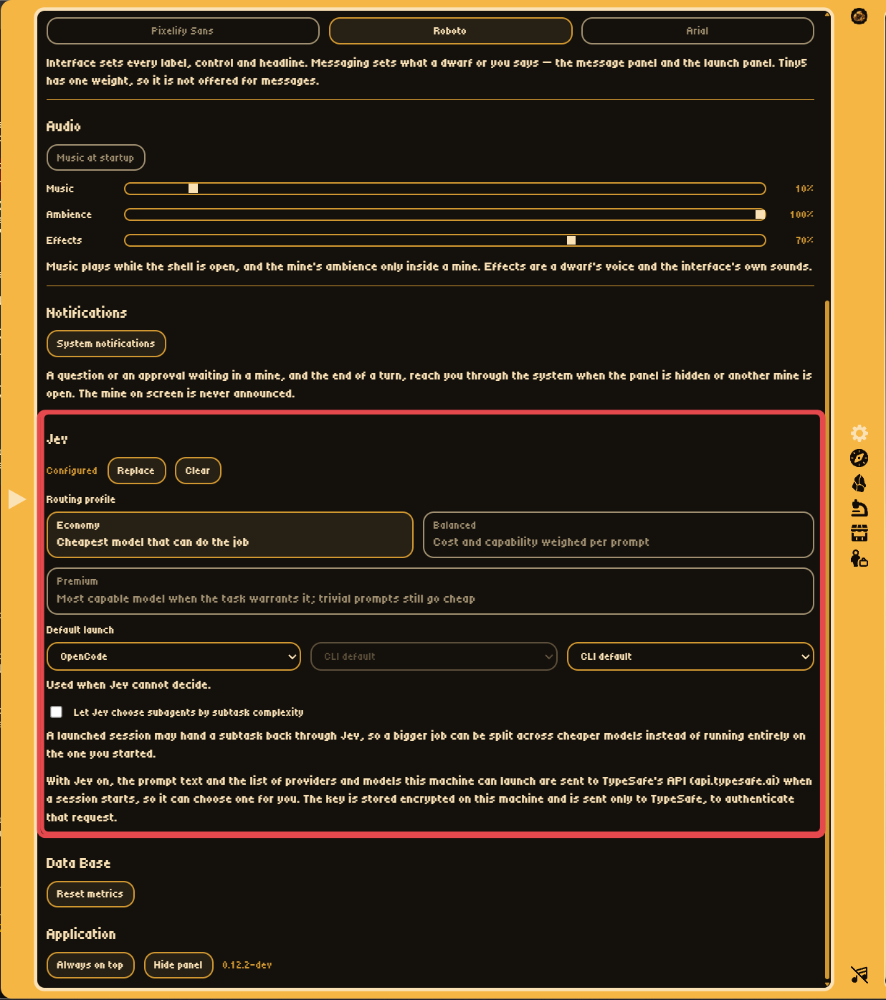
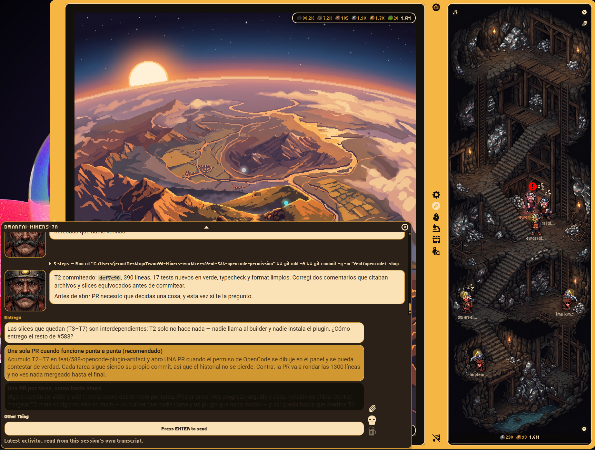

<p align="center">
  
</p>

<h1 align="center">DwarfAI-Miners</h1>

<p align="center">
  Your AI coding sessions as a tiny isometric mining colony, floating on your desktop.
</p>

<p align="center">
  
  &nbsp;&nbsp;&nbsp;&nbsp;
  
   &nbsp;&nbsp;
  
  &nbsp;&nbsp;&nbsp;&nbsp;
  
</p>

<div align="center">

[](https://github.com/JeronimoRepetto/DwarfAI-Miners/actions/workflows/ci.yml)
[](https://github.com/JeronimoRepetto/DwarfAI-Miners/releases/latest)
[](https://github.com/JeronimoRepetto/DwarfAI-Miners/releases)

[](LICENSE)
[](https://ko-fi.com/jeronimorepetto)


</div>

DwarfAI-Miners is a floating desktop panel that turns active AI coding sessions into mines and
dwarfs. A mine represents one project; workers and foremen represent the agents currently
operating in that project.

**Status:** functional MVP. Session detection for Claude Code, Codex, Antigravity and OpenCode;
live IPC updates; mine tiers; animated dwarfs; a floating message panel you can send into, attach
files to, kick from and read history in; terminal focus with a transcript fallback; background
music, mine ambience and dwarf voices; autostart; and packaging are all implemented. Windows is
the platform verified end to end; macOS and Linux have been run on real hardware with lighter
coverage — the [support matrix](#platform-support) says which is which.

## Feature tour

The panel is designed to be understood at a glance: the map answers **where work is happening**, and
the mine answers **what each agent is doing**.

<table>
  <tr>
    <td align="center"></td>
    <td align="center"></td>
  </tr>
  <tr>
    <td align="center"><strong>Map</strong><br>See every active project at once.</td>
    <td align="center"><strong>Mines</strong><br>Search, filter by tier, and open a project directly.</td>
  </tr>
  <tr>
    <td align="center"></td>
    <td align="center"></td>
  </tr>
  <tr>
    <td align="center"><strong>Mine interior</strong><br>Watch the crew and their status.</td>
    <td align="center"><strong>Messages</strong><br>Read history, send, kick, and follow a session's own words.</td>
  </tr>
  <tr>
    <td align="center"></td>
    <td align="center"></td>
  </tr>
  <tr>
    <td align="center"><strong>Launch</strong><br>Start a session in a project mine, with a model and effort — or let Jev pick.</td>
    <td align="center"><strong>Settings</strong><br>Configure the shortcut, the panel's side, and sound.</td>
  </tr>
  <tr>
    <td align="center"></td>
    <td align="center"></td>
  </tr>
  <tr>
    <td align="center"><strong>Jev</strong><br>An optional routing assist that chooses the provider, model, and effort for you.</td>
    <td align="center"><strong>Questions</strong><br>Answer a blocked agent's question straight from the panel.</td>
  </tr>
</table>

<!-- TODO(maintainer): the tour needs a capture of the message panel as its own floating window, dragged clear of the shell (#296). `messages.png` still shows the older docked panel. -->

The [art pipeline](docs/architecture.md#art-pipeline) explains how the shipped assets are
processed.

## Highlights

- **Live session detection** — Claude Code, Codex, Antigravity and OpenCode sessions become dwarfs
  the moment they appear, no configuration required.
- **Every worktree, one mine** — start a session in any git worktree of a project and it lands in
  that project's own mine, not a new one; a dwarf's message panel names which worktree it is
  actually in whenever a crew is spread across more than one.
- **Two illustrated views** — a world map that follows the time of day, with one tier-coloured
  marker per project, and a mine interior where the crew swings pickaxes, naps, or walks out.
- **A message panel that floats** — click a dwarf and its conversation opens in a window of its
  own, which you can drag anywhere on the desktop and which stays where you left it. The composer
  already has the cursor, so there is no extra click before you can type (#409).
- **Send, with an honest verdict** — your message is drawn in the panel the instant you press
  Enter, and its own bubble carries the delivery mark: ✓ handed over, ✓✓ the session was seen
  acting, ✕ with the reason and a **Send again** beside it.
- **Attach files to a message** — drop them on the composer or press the paperclip. An image
  travels as the image itself; anything else, as its path for the session to open with its own
  tools. A Windows console, a macOS Terminal.app tab or tmux pane, a Linux tmux pane, and any
  session this panel holds can all take one, capped at 5 files and 30 MB of images per message
  (#408, #417).
- **Markdown, in agent and person bubbles alike** — bold text, lists, quotes, tables, strikethrough,
  horizontal rules, inline and fenced code draw as such instead of raw asterisks, backticks and
  pipes; an image draws as its alt text, and a link — or that alt text — opens in your system
  browser (#412).
- **Read back through the conversation** — scroll to the top of a dwarf's panel and the twelve
  things said before those load in place, twelve at a time, as far back as its transcript goes.
- **Answer an agent's question** — click the option it offered, or toggle several and press
  **Answer**; the panel presses that at the session's own console. Verified on Windows; on macOS a
  permission or single-select answer reaches a Terminal.app tab or a tmux pane the same way, and a
  multi-select or "Other Thing" answer instead types the keys, which needs the foreground window
  and Accessibility permission. Not Codex.
- **Talk to a macOS or Linux session without touching its window** — a message written into a
  Terminal.app tab (macOS) or a tmux pane (either platform) lands by tty, not by focus: a session
  in a background tab or an unfocused pane receives it exactly as the console-write path already
  does on Windows.
- **Kick in one click** — one press ends a session running in a terminal, interrupts one the panel
  is holding, and otherwise sends the dwarf off the rock instead — and says which it did.
- **Sound** — eight shuffled background tracks, a mine ambience that follows whether the crew is
  actually mining, and a voice per dwarf rank on click plus the shell's own interface sounds. All
  of it optional, from [Settings](docs/guide.md#settings).
- **Panel motion** — pages and floating panels open and close in 250 ms, independent of display
  scale. The system's reduced-motion preference makes these transitions instantaneous.
- **Instant updates** — an opt-in Claude-hooks push channel turns the 2-second poll into tens of
  milliseconds.
- **Terminal focus** — clicking a dwarf focuses its terminal window, with a live transcript
  viewer as the fallback.
- **Autostart and tray** — starts at login, lives in the tray, and hides instead of closing.

Every screen and control is described in the [user guide](docs/guide.md).

## Install

Download the installer for your OS from the
[latest release](https://github.com/JeronimoRepetto/DwarfAI-Miners/releases/latest):

| Platform | File                                                          |
| -------- | ------------------------------------------------------------- |
| Windows  | `DwarfAI-Miners-Setup-*.exe` (installer) or `-Portable-*.exe` |
| macOS    | `DwarfAI-Miners-*.dmg` (arm64 or x64, matching your Mac)      |
| Linux    | `DwarfAI-Miners-*.AppImage` or the `.deb` package             |

Signing, honestly: **macOS installers are signed and notarized from v0.8.0 onward.** v0.7.0 and
earlier were not, which is what the macOS note below is about. Windows and Linux are never signed —
[`docs/signing.md`](docs/signing.md) records what is signed, what is not, and what fixing the rest
would take. So:

- **macOS**: an installer from v0.7.0 or earlier still gets blocked by Gatekeeper on a normal
  double-click. Right-click (or Control-click) the app and choose **Open**, then confirm in the
  dialog — only needed once — or clear the quarantine attribute:
  `xattr -cr "/Applications/DwarfAI-Miners.app"`. Neither is needed for a signed release.
- **Windows**: SmartScreen shows "Windows protected your PC" and an unverified publisher on a
  fresh machine. Click **More info** → **Run anyway**.
- **Linux**: make the AppImage executable before running it: `chmod +x DwarfAI-Miners-*.AppImage`.

Every release is built and packaged on the target OS. Windows is verified end to end; macOS and
Linux have been run with lighter coverage — see the support matrix below.

### First run

Launch DwarfAI-Miners and it will start minimized to the tray. Use **Ctrl+Alt+Shift+P** (or the
tray menu) to open the panel. Once packaged, the app enables start-at-login by default; you can
change that choice from the tray menu. The first run never sends session data anywhere — see
[Privacy](docs/privacy.md).

Three things worth knowing on that first run:

- **You need nothing to configure.** Start a Claude Code, Codex, Antigravity or OpenCode session in
  any project and its dwarf appears within about two seconds. Claude, Codex and OpenCode turn that
  session's tokens into mined coal and ore as it runs; Antigravity's dwarf appears and works the
  mine too, but its CLI records no token figure to mine from (verified on 1.1.26), so it never adds
  material — see [Provider support](#provider-support).
- **Music starts playing.** That is the shipped default; the note button at the bottom of the
  navigation column silences it for this run, and Settings' **Music at startup** is where you say
  it should stay off. See [Sound](docs/guide.md#sound).
- **The first few launches do a one-time history scan** of your existing transcripts, to fill the
  coal pile with the tokens you burned before installing this. It is bounded, resumable, and
  described in full in [`docs/privacy.md`](docs/privacy.md#the-one-time-history-scan).

## Run from source

```bash
pnpm install
pnpm dev
```

The panel starts hidden. Press **Ctrl+Alt+Shift+P** or click the tray icon to show it. The
combination is configurable: open the gear in the panel titlebar and record a new one. If
another application already owns a combination, registration fails, the previous shortcut is
re-claimed, and the settings panel says so rather than showing a shortcut that does nothing.

> Electron 42+ ships no postinstall; `pnpm dev` runs `install-electron` first. If the
> binary is ever missing (an interrupted download, say), run `pnpm exec install-electron`.

The checks CI runs, the testing philosophy and the rest of the contribution workflow are in
[`CONTRIBUTING.md`](CONTRIBUTING.md).

## Platform support

Every operating-system-specific behavior sits behind a port selected in one place
(`src/main/platform/platformAdapters.ts`), and each adapter's commands and file contents are
unit-tested as pure builders. macOS and Linux have been run on real hardware, but with far less
mileage than Windows, so the table keeps the distinction between verified and expected.

<details>
<summary><strong>Full support matrix</strong> (Windows verified; macOS/Linux run, lighter coverage)</summary>

| Capability                                     | Windows                                                   | macOS                                                                                                                                                                                    | Linux                                                           |
| ---------------------------------------------- | --------------------------------------------------------- | ---------------------------------------------------------------------------------------------------------------------------------------------------------------------------------------- | --------------------------------------------------------------- |
| Overall                                        | **Verified**                                              | Run, lighter coverage                                                                                                                                                                    | Run, lighter coverage                                           |
| Session detection (Claude Code / Codex)        | Verified                                                  | Expected to work (home-relative paths)                                                                                                                                                   | Expected to work                                                |
| Antigravity session detection                  | Verified                                                  | Expected to work (home-relative paths)                                                                                                                                                   | Expected to work                                                |
| OpenCode session detection                     | Verified                                                  | Expected to work (no per-OS branch — one SQLite store, `~/.local/share/opencode`)                                                                                                        | Expected to work                                                |
| Codex liveness probe                           | PowerShell `Win32_Process`                                | `pgrep -fl codex`                                                                                                                                                                        | `pgrep -fa codex`                                               |
| Click-to-focus a terminal                      | user32 via PowerShell                                     | `ps` + System Events (`osascript`)                                                                                                                                                       | **Unsupported** — falls back to viewer                          |
| Live transcript viewer                         | Windows Terminal / PowerShell                             | Terminal.app via `osascript`                                                                                                                                                             | `x-terminal-emulator` → … → `xterm`                             |
| Write a message into a session's console       | **Verified — the default**                                | Terminal.app tab, or a tmux pane for any other host (on by default); everything else relays                                                                                              | tmux pane write (built, unmeasured); other hosts relay          |
| Relay a message to a named session             | Supported — the fallback                                  | Supported — the fallback for a host that is neither a Terminal.app tab nor a tmux pane                                                                                                   | Supported — the fallback for a session outside tmux             |
| Queue a message to a Codex CLI session         | **Verified** — a native, npm or pnpm install alike (#413) | Expected to work (spawns `codex`)                                                                                                                                                        | Expected to work (spawns `codex`)                               |
| Answer a permission or question at the console | **Verified**                                              | Terminal.app tab, or a tmux pane: permission and single-select answers; multi-select and "Other Thing" answers take keystrokes (Accessibility, window in front); other hosts unsupported | tmux pane write (built, unmeasured); other hosts relay          |
| Attach files to a message                      | **Verified** — console or held Claude session             | Terminal.app console, a tmux pane, or held Claude session; other hosts held only                                                                                                         | tmux pane write (built, unmeasured); held Claude session        |
| Kick a session running in a terminal           | **Verified** — clean exit, then force                     | Implemented (SIGTERM, then SIGKILL); unreachable until measured                                                                                                                          | Implemented (SIGTERM, then SIGKILL); unreachable until measured |
| Start at login                                 | HKCU Run key                                              | `~/Library/LaunchAgents` plist                                                                                                                                                           | `~/.config/autostart` desktop entry                             |
| Packaging                                      | NSIS + portable                                           | dmg + zip (arm64 & x64)                                                                                                                                                                  | AppImage + deb                                                  |

The two message rows are one decision seen from two sides, and it reversed twice —
[`docs/console-hosting.md` §4b](docs/console-hosting.md) records every reversal. Where the panel can
reach a console (Windows today), a message is **written straight into the input of the console that
session's own process is attached to**, addressed by verified process id: no window is raised,
nothing goes on your clipboard, and which tab of a terminal is in front stops mattering — a session
in a background tab receives its message and the tab you are working in sees nothing (#371). Where
it cannot (macOS, Linux), a Claude session with a registry name takes the relay instead, which
touches no window either. The relay is also the fallback on Windows, and only for the failures that
prove nothing was written: an attach the console refused, or a console input that would not open.
Kick is no longer a keystroke at all: it ends the session's own process by verified pid,
which needs no window, so its row above is about a signal rather than about reaching a console. What
macOS and Linux still lack there is not the signal but the reading that verifies a pid — no Claude
session registry entry has been measured for a process creation time on either — so a kick with no
verified pid is refused with that reason rather than sent.

Notes on the three honest gaps:

- **Linux window focus** is unsupported on purpose. `wmctrl`/`xdotool` are X11-only, absent by
  default, and blocked outright under Wayland; guessing would mean hanging on a tool that is not
  there. Clicking a dwarf goes straight to the transcript viewer instead.
- **macOS console input** is implemented and still gated off behind the
  `DARWIN_CONSOLE_INPUT_ENABLED` constant in `src/main/platform/platformAdapters.ts` — set the
  `DARWIN_CONSOLE_INPUT` environment variable (see
  [Diagnostic switches](docs/guide.md#diagnostic-switches)) to test it. It is two mechanisms, and
  they ask for different things. A **message** is written into the Terminal.app tab the session's
  own tty names: no window is raised, no keystroke is synthesized, and macOS asks only for
  Automation permission to control Terminal. A **permission or question key** must not carry a
  Return, so it stays a System Events keystroke at the foreground and still needs Accessibility
  permission, which the app cannot detect. Only Terminal.app has been measured; a session in
  iTerm2, WezTerm, Alacritty, kitty, Ghostty, Hyper or Warp is refused by name rather than guessed
  at. While the switch is off, a session with a registry name still takes the relay, and one
  without gets a Send and a Kick rendered disabled with their reason rather than silently typing
  nowhere. The measurements are in
  [`docs/console-hosting.md`](docs/console-hosting.md); Linux has no console-write path yet.
- **Session-data layouts** (`~/.claude`, `~/.codex`, `~/.gemini/antigravity-cli`,
  `~/.local/share/opencode`) are assumed platforms. They are home-relative already and nothing in
  the formats is Windows-specific, but this has not been confirmed against real macOS/Linux
  fixtures.

</details>

## Provider support

Three questions get three separate answers, because they are three different bars: can this app
**read** a provider's sessions, can it **launch** one, and can it **hold** one open so its words
arrive live.

| Provider    | Read | Launch | Hold   | Notes                                                                                                                                                                                                                                                                                                                                                                                                                                                                                                                                                                                                                                                                                                                                                                                                                                            |
| ----------- | ---- | ------ | ------ | ------------------------------------------------------------------------------------------------------------------------------------------------------------------------------------------------------------------------------------------------------------------------------------------------------------------------------------------------------------------------------------------------------------------------------------------------------------------------------------------------------------------------------------------------------------------------------------------------------------------------------------------------------------------------------------------------------------------------------------------------------------------------------------------------------------------------------------------------ |
| Claude Code | yes  | yes    | yes    | Uses `~/.claude*/sessions/<pid>.json`, verifies a live PID, and reads parent/subagent transcripts. Multiple Claude roots are supported. The one provider with a complete held-session surface: interrupt, context reading, and answers to its own question and permission prompts.                                                                                                                                                                                                                                                                                                                                                                                                                                                                                                                                                               |
| Codex       | yes  | yes    | no     | Uses the `state_5.sqlite` registry, `logs_2.sqlite` heartbeats, rollout growth and open-turn events; mtime is the last resort, never the lead (#1). `thread_spawn.parent_thread_id` gives verified worker/foreman relationships. A launch is detached — `codex exec` in the mine's folder, discovered afterwards by the poll. Messages go to Codex's own queue, reached through the same npm/pnpm `.cmd`-shim resolution the launcher already had, so an npm or pnpm install works and `CODEX_CLI_PATH` is no longer needed for it (#413).                                                                                                                                                                                                                                                                                                       |
| Antigravity | yes  | yes    | partly | Reads the `agy` CLI's own store under `~/.gemini/antigravity-cli`: a presence lock per running conversation, `history.jsonl` for the workspace, and the conversation's `transcript.jsonl` for the feed and for whether a turn is open. A held `agy` session can be spoken to; see [Providers in depth](docs/guide.md#providers-in-depth) for what its protocol does not offer.                                                                                                                                                                                                                                                                                                                                                                                                                                                                   |
| OpenCode    | yes  | yes    | no     | Reads `opencode.db` (SQLite) under `~/.local/share/opencode` read-only: session rows, an event log for liveness, and message/part rows for the feed. A subagent spawned with the `task` tool is drawn as a worker beside its foreman. Launch is detached — `opencode run` in the mine's folder, with a live model catalogue and a per-model effort picker read straight from `opencode models --verbose`, verified on Windows. Sending a message to a launched or observed ROOT session works, through a new `opencode run --session <id>` process per turn — a message typed while one is already running waits and is sent when that turn ends, since a concurrent call was measured to race rather than refuse. A worker session still takes no message — no held session either; see [Providers in depth](docs/guide.md#providers-in-depth). |

Each provider's limits, effort levels and how foremen and workers are told apart are in the
[user guide](docs/guide.md#providers-in-depth).

## Configuration

Everything below is optional — the defaults work out of the box. **Which mechanism you use
depends on how you are running DwarfAI-Miners**, because `dotenv` resolves `.env` relative to the
working directory, and an installed app never runs from this repository.

| How you run it                    | Where settings go                                                                                                                    |
| --------------------------------- | ------------------------------------------------------------------------------------------------------------------------------------ |
| Development checkout (`pnpm dev`) | Copy `.env.example` to `.env` in the repo root.                                                                                      |
| Installed app                     | A `config-v1.json` file in the app's user-data directory (see the [configuration reference](docs/guide.md#configuration-reference)). |

Settings are resolved most specific first: **real environment variables → the user-data config
file → built-in defaults.** A real environment variable therefore always wins, on either setup,
and a development checkout with a `.env` behaves exactly as it always has.

The config file's location per platform, every setting with its default, and the diagnostic
switches are in the [configuration reference](docs/guide.md#configuration-reference).

**The Jev API key is not one of those layers.** It is a secret you type into Settings, not an
operator value, so it is never read from `.env` or written into `config-v1.json` — enter, replace
or clear it from the Jev section of Settings only, on either setup. It is stored encrypted on this
machine rather than as plain configuration; [`docs/privacy.md`](docs/privacy.md#what-it-transmits)
says what it is used for and what leaves the machine once it is set.

**Once a key is set**, the Jev section of Settings also shows a routing profile and a default
launch — both plain preferences, both set from Settings only, and both hidden along with the rest
of the section until a key is configured. The profile is one of **economy** (cheapest model that
can do the job), **balanced** (cost and capability weighed per prompt), or **premium** (most
capable model when the task warrants it — trivial prompts still go cheap on every profile). The
default launch is the provider, model and effort a session falls back to when Jev cannot decide;
leaving any of the three unset keeps that part of a launch on the CLI's own default, exactly like
an ordinary untuned launch. Neither is ever a guess this app makes for you — see
[`docs/privacy.md`](docs/privacy.md#what-it-transmits) for what changed on the wire, and the
[`jev-capabilities`](skills/jev-capabilities/SKILL.md) skill for how a model earns a place in the
table the profile routes through.

## Reporting a problem

- **Bugs, features and roadmap** → [GitHub issues](https://github.com/JeronimoRepetto/DwarfAI-Miners/issues).
  Name your platform, the version the Settings panel shows (the `-dev` suffix matters), and how to
  reproduce it. Check your platform's row in the [support matrix](#platform-support) first — a
  row marked expected rather than verified is often the whole explanation.
- **Vulnerabilities** → privately, through the flow in [`SECURITY.md`](SECURITY.md). Never a public
  issue.
- **Questions about what the app reads or stores** → [`docs/privacy.md`](docs/privacy.md) answers
  those with the source file behind each claim.

If you run macOS or Linux, the single most useful thing you can file is what happened when you
walked the support matrix on real hardware — including "it all worked". See
[CONTRIBUTING.md](CONTRIBUTING.md#platform-validation--help-wanted).

## Documentation

**Start here:**

- [`docs/guide.md`](docs/guide.md) — every screen and control, the message panel, sound, settings,
  the hooks channel, and the full configuration reference.
- [`docs/architecture.md`](docs/architecture.md) — how main, preload and renderer fit together, the
  platform ports, security posture, the art pipeline and packaging.
- [`CONTRIBUTING.md`](CONTRIBUTING.md) — development setup, verification commands, testing
  philosophy, commit conventions, and where help is wanted.
- [`SECURITY.md`](SECURITY.md) — supported versions, private vulnerability reporting, scope.
- [`docs/privacy.md`](docs/privacy.md) — the data boundary: what the app reads, stores, and
  transmits.
- [`docs/signing.md`](docs/signing.md) — what is signed, what is not, and what fixing the rest
  takes.
- [`docs/README.md`](docs/README.md) — **the index to every other document in `docs/`**, including
  the provider-format research, the design and evaluation notes, and the measurement records.

- [`LICENSE`](LICENSE) — MIT license for the code.
- [`ARTWORK-LICENSE.md`](ARTWORK-LICENSE.md) — proprietary terms for the project's visual and
  audio assets.

## Support the project

DwarfAI-Miners' code is free and MIT-licensed. The artwork remains the creator's property and is
not separately reusable without authorization. If the project has earned a spot on your desktop,
you can support its development on [Ko-fi](https://ko-fi.com/jeronimorepetto). Entirely optional —
nothing in the app is, or will be, gated on it.

## License

[MIT](LICENSE) © 2026 Jeronimo Repetto — code only. The visual and audio assets are protected by
copyright and covered separately by [`ARTWORK-LICENSE.md`](ARTWORK-LICENSE.md); they may not be
reused without prior written authorization.
